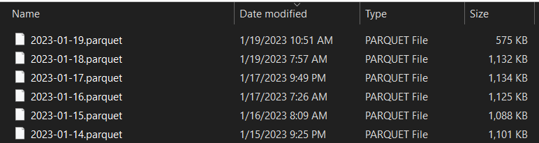

# Automate the RITIS Massive Data Downloader
A Python class for automated downloading of INRIX XD segment data using the RITIS Massive Data Downloader interface. Use at your own risk, this code is not guaranteed to work and is not supported by ODOT or RITIS. It is provided as-is, but contributions are welcome. Please avoid placing excessive or redundant request, be considerate of the loads being placed on the server which impact other users.

## What problem does this solve?
Currently, the RITIS API supports downloading data from TMC roadway segments only, it does not support XD segment data. This is unfortunate because XD segment data is much better for analysis at the intersection level, such as for traffic signals. Once the RITIS API includes XD segment data, this code will be rewritten to call the API. Alternativley, the INRIX API could be used but provides lower quality data for some reason.

## How does it work? 

Three different methods of downloading data are provided, including:

   1. single_download() - One-time download for single date range
   2. daily_download() - Download data for each day starting at the date in the last_run file (default is last_run.txt) through yesterday. This method is intended to be called on a daily schedule, for example, use Windows task scheduler to run at 1am each morning.
   3. continuous_download() - Meant to run as a background process throughout the day. It downloads most recent data on regular user specified intervals. After the end_time has elapsed then the process terminates. This method is meant to be run on a daily schedule, just like the daily_download() method.

## Example Usage
```python
# Working in same directory as RITIS_Downloader.py import as follows
from RITIS_Downloader import RITIS_Downloader

# This is optional
import warnings
warnings.simplefilter('ignore')

# Initiate class
updater = RITIS_Downloader(
    download_path='Data', #data will be saved in this folder/path
    start_time='06:00:00', #default is '00:00:00
    end_time='19:59:00', #default is '23:59:00'
    bin_size=15, #Enter 5, 10, 15(default), or 60
    units='seconds', #'seconds'(default) or 'minutes'
    columns=['travel_time_minutes'], #["speed","average_speed","reference_speed","travel_time_minutes","confidence_score","cvalue"]
    confidence_score=[30], #[10,20,30]
    last_run='last_run.txt', #path for text file containing last run datetime
    continuous_download_interval=15 #New data download every 15 minutes, for continiuous_download() only
    #,browser_verification=False #If internet connection is through ODOT VPN set this to False
    ) 

# Run one of three fuctions
updater.single_download(start_date='2023-01-01', end_date='2023-01-07', job_name='Test_Download')
#updater.daily_download() #Save a parquet file for each day from last_run through yesterday
#updater.continuous_download() #Run daily_download() plus update parquet file with today's day every n minutes
```

## Aditional Details

Do not schedule both daily_download() and continuous_download() to run together, only pick one method to use.
When continuous_download() is run, it will call daily_download() first to make sure data is updated through yesterday, if needed. Both those functions will update the last_run file each time new data is downloaded, so the process will pick up where it left off
if interrupted. 

The data are saved in parquet file format, which is many times faster and smaller than csv. Parquet files can be read by Pandas, the Arrow package in R, and even Power BI. There will be a single file saved for each date, like image below:



Data will include all XD segments from a text file `segments.txt` (or file specified by user).

The last run datetime will be saved in the `last_run.txt` file when daily_download() or continuous_download() are run.

## Credits
Special thanks to ChatGPT for helping write and review this code.

Contact Info: shawn.strasser@odot.oregon.gov
